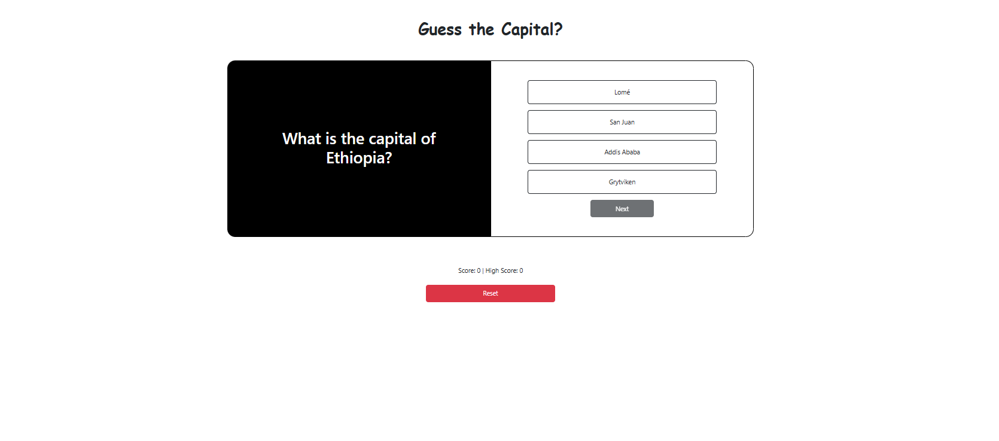

# Guess-the-Capital-

This is a Quiz Game called **Guess the Capital**. The application tests your knowledge of world capitals by presenting you with a country and multiple-choice options for its capital. Your goal is to select the correct capital from the given options.

## Features

- Randomly generates a country and its capital from a predefined dataset.
- Provides four answer options, including one correct answer and three distractors.
- Highlights correct and incorrect answers with visual feedback.
- Allows users to proceed to the next question or retry after answering.
- Built using HTML, CSS, JavaScript, and jQuery for interactivity.
- Styled with Bootstrap for a responsive and modern design.

## How It Works

1. The app fetches data from a local JSON file containing a list of countries and their capitals.
2. A random country is selected, and its capital is displayed as one of the answer options.
3. The remaining options are randomly chosen incorrect answers.
4. Users select an answer, and the app provides immediate feedback:
   - Correct answers are highlighted in green.
   - Incorrect answers are highlighted in red.
5. Users can click "Next" to proceed to the next question or retry the current one.

## Technologies Used

- **HTML**: For structuring the web page.
- **CSS**: For styling the application.
- **JavaScript**: For implementing game logic.
- **jQuery**: For DOM manipulation and event handling.
- **Bootstrap**: For responsive design and UI components.

## How to Play

1. Open the app in your browser.
2. Read the question: "What is the capital of [Country]?"
3. Click on one of the four answer options.
4. Check the feedback and click "Next" to continue.

Enjoy testing your geography knowledge with **Guess the Capital**!